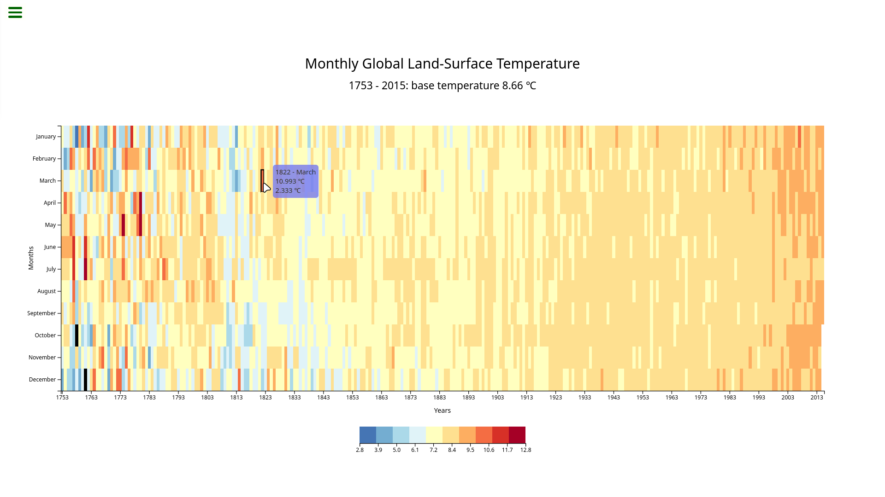

    
  <a href="https://github.com/mateus-sartorio/heat-map-with-d3"><kbd>🔵 GitHub</kbd></a>

# FreeCodeCamp Heat Map Challenge

 

  

 

This project is a heat map visualization displaying global land-surface temperatures from 1753 to 2015. The graph highlights monthly temperature variances over the years, with color-coded rectangles representing the change in temperature relative to the base average. The D3.js library is used for building the interactive chart, including tooltips, axis labels, and a color legend to interpret the temperature ranges.

This project is the third challenge for the [Data Visualization certification](https://www.freecodecamp.org/learn/data-visualization) from freeCodeCamp and can be found [here](https://www.freecodecamp.org/learn/data-visualization/data-visualization-projects/visualize-data-with-a-heat-map).